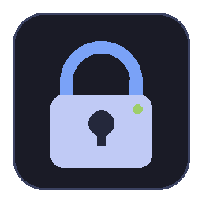
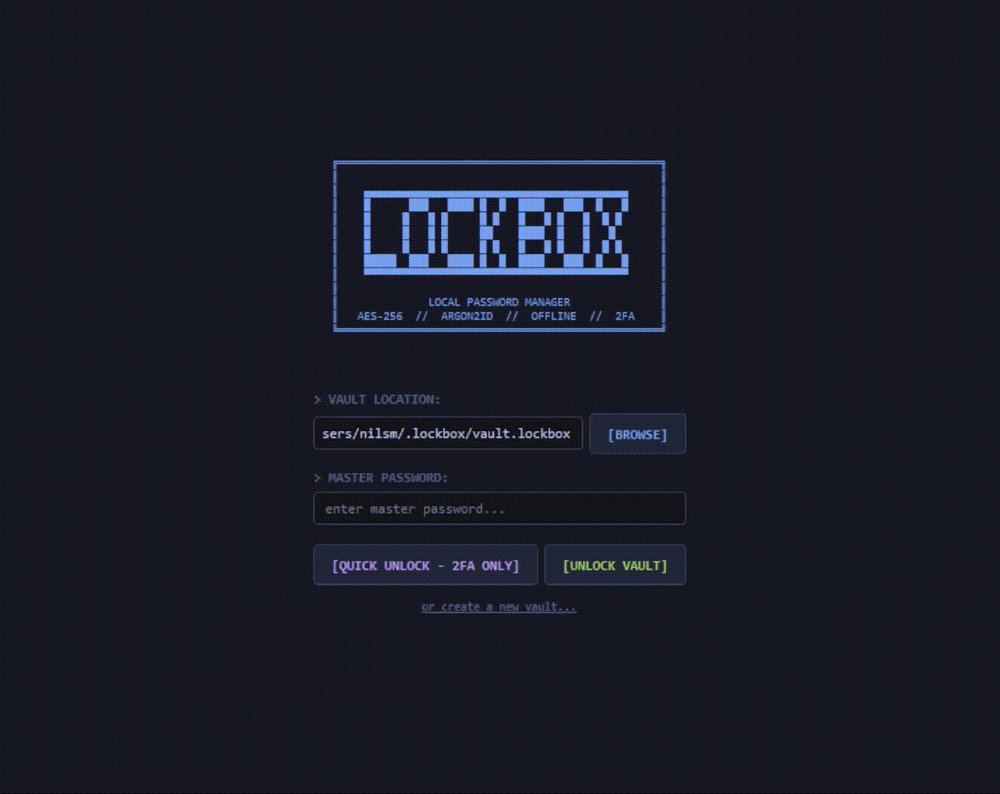
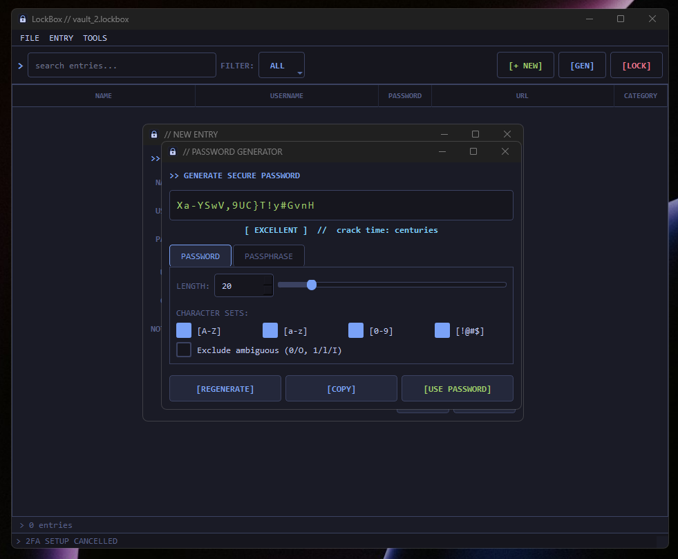
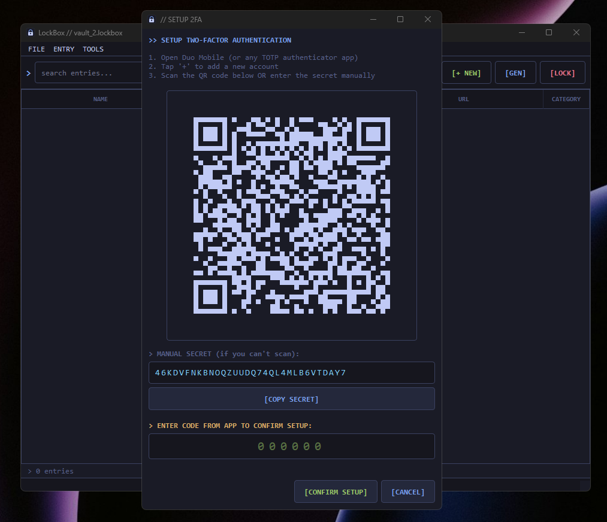

<p align="center">
  
</p>

<h1 align="center">LockBox</h1>

<p align="center">
  <strong>Offline, local-first password manager.</strong><br>
  No cloud. No subscriptions. Just your passwords, encrypted on your machine.
</p>

<p align="center">
  
  
  
  
  
</p>

---

## Why LockBox?

- **Fully offline** -- your passwords never leave your machine
- **No accounts, no cloud sync, no telemetry** -- zero trust required
- **AES-256-GCM** encryption with **Argon2id** key derivation (64MB memory cost, 3 iterations)
- **TOTP 2FA** support via Duo Mobile, Google Authenticator, or any TOTP app
- **Compiles to a single `.exe`** -- no install, no dependencies at runtime
- **Free and open source** forever

## Features

- Encrypted vault stored locally (`~/.lockbox/vault.lockbox`)
- Cryptographically secure password and passphrase generator
- TOTP two-factor authentication with QR code setup
- 30-day "remember me" quick unlock (2FA code only)
- CSV / key-value / delimited import from existing password files
- Category-based organization with color coding
- Clipboard auto-clear (30 seconds)
- Auto-lock after 5 minutes of inactivity
- Tokyo Night-inspired dark theme
- 3D spinning ASCII logo on the login screen

## Screenshots

<p align="center">
  
</p>

<p align="center">
  
  <br>
  <em>Cryptographic password & passphrase generator with strength meter</em>
</p>

<p align="center">
  
  <br>
  <em>TOTP two-factor authentication setup with QR code</em>
</p>

## Getting Started

### Run from source

```bash
git clone https://github.com/matteso1/lockbox.git
cd lockbox
pip install -r requirements.txt
python lockbox.py
```

### Build standalone `.exe`

```bash
pip install -r requirements.txt
python build.py
```

The compiled binary will be in `dist/LockBox.exe`. Your vault data is stored separately in `~/.lockbox/` -- the exe contains no passwords.

## Vault Format

```
[LOCKBOX1 magic (8 bytes)]
[version (2 bytes)]
[salt (16 bytes)]
[AES-256-GCM encrypted JSON blob]
```

The JSON blob contains all entries and metadata. The encryption key is derived from your master password using Argon2id with:
- **Memory cost:** 64 MB
- **Time cost:** 3 iterations
- **Parallelism:** 4 threads
- **Salt:** 16 random bytes (unique per vault)

## Security Model

- Passwords are encrypted at rest with AES-256-GCM (authenticated encryption with associated data)
- Key derivation uses Argon2id, the winner of the Password Hashing Competition, tuned to resist GPU/ASIC attacks
- Password strength validated by [zxcvbn](https://github.com/dropbox/zxcvbn) (Dropbox's realistic password estimator) -- detects dictionary words, keyboard patterns, l33t speak, and more. Pro tip: use a passphrase ([xkcd 936](https://xkcd.com/936/))
- TOTP secrets are stored inside the encrypted vault (not in plaintext)
- Session files for quick unlock are protected with Windows DPAPI (bound to the current user account) and expire after 30 days
- Constant-time key comparison (`hmac.compare_digest`) prevents timing attacks
- Exponential backoff on failed unlock attempts prevents brute-force through the UI
- File permissions set to owner-only (`0600`) on vault and session files
- Atomic writes (write to `.tmp`, then rename) prevent vault corruption on crash
- No network calls, no analytics, no update checks -- fully air-gapped

## Known Limitations

These are inherent to the design or the Python runtime and are documented for transparency:

- **Python memory handling**: Python strings are immutable and cannot be securely zeroed from memory. Decrypted passwords, keys, and the master password may persist in process memory until garbage collected. If an attacker can dump your process memory (via debugger, crash dump, or hibernation file), they could extract secrets. Mitigation: use full-disk encryption (BitLocker/LUKS).
- **SSD secure deletion**: The "overwrite before delete" on session files does not guarantee the original data is erased on SSDs due to wear leveling. The DPAPI protection on Windows is the primary defense, not file deletion.
- **TOTP secret co-location**: The TOTP secret is stored inside the encrypted vault. If an attacker cracks your master password offline, they also get the TOTP secret. The 2FA protects against unauthorized UI access (e.g., shoulder surfing), not against offline vault cracking. Use a strong master password.
- **No code signing**: The built `.exe` is unsigned. Verify builds by cloning and building from source, or check SHA-256 hashes of releases.

## Project Structure

```
lockbox.py        # Entry point
crypto_utils.py   # AES-256-GCM, Argon2id, password generation
vault.py          # Encrypted vault data model
session.py        # Quick unlock session management
ui.py             # PyQt6 GUI
build.py          # PyInstaller build script
gen_icon.py       # Icon generator
```

## Requirements

- Python 3.10+
- PyQt6
- cryptography
- argon2-cffi
- pyotp
- qrcode[pil]

## License

MIT
